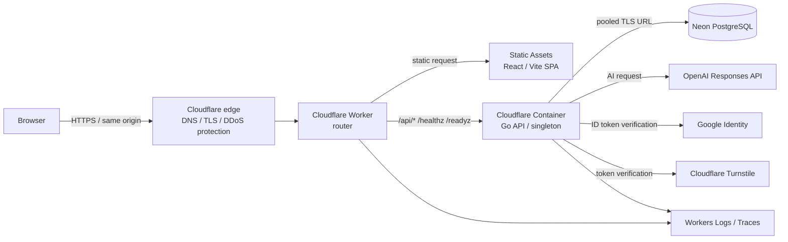
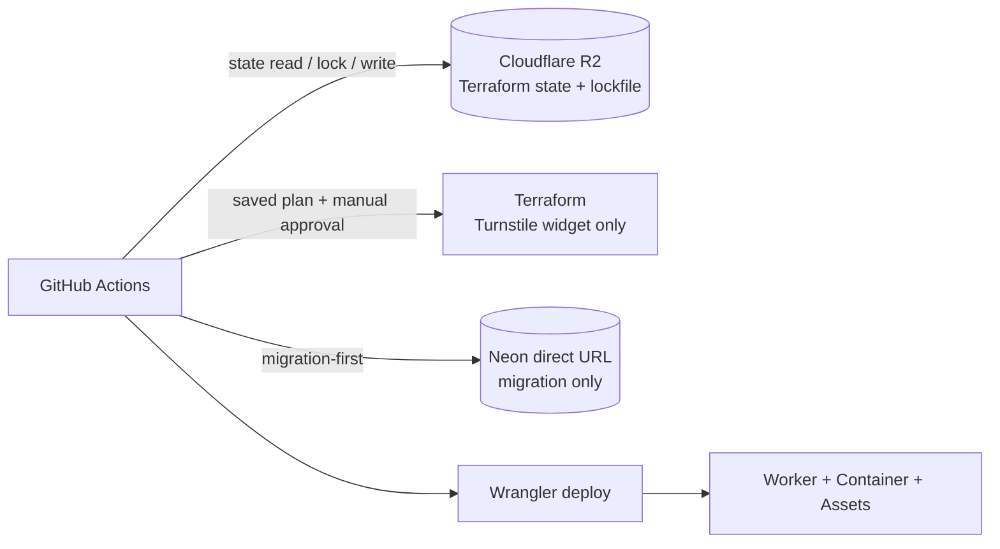

# Infrastructure review context

この文書は、外部AIへ現在のインフラ構成を伝え、改善案・代替案をレビューしてもらうための**2026-08-20時点のスナップショット**です。仕様や運用手順のSource of Truthではありません。判断や変更の前に、必ず [`design.md`](design.md)、[`deployment.md`](deployment.md)、[`operations.md`](operations.md)、[`environment.md`](environment.md)、[`database.md`](database.md) と実装を再確認してください。

秘密値、account ID、credential、接続文字列、production dataは含みません。

## 1. 要約

- React/Vite SPAとGo APIで構成するsame-originのWebアプリケーション。
- 現在cloudへ実装済みなのは検証用の`Staging Light`だけ。Productionは未構築。
- Cloudflare Workerがstatic assetsを配信し、APIとhealth checkをCloudflare Containerへrouteする。
- Go APIはNeon PostgreSQL、OpenAI Responses API、Google Identity、Cloudflare Turnstileを利用する。
- StagingのContainerは`lite`、最大1 instance、APAC、idle 10分でsleepする単一構成。
- TerraformはTurnstile widgetだけを管理し、Worker、Container、assets、domain、runtime secretsはWranglerが管理する。
- GitHub ActionsがCI、承認付きTerraform saved plan apply、DB migration、application deployを担当する。
- Cloudflare logs/tracesとapplicationのstructured loggingはあるが、dashboard、alert、通知、uptime monitorはIaC化されていない。

主要versionはReact 19.2.0、Vite 7.3.6、Node.js 24以上、Go module 1.26.0（Container buildはGo 1.26.6）、PostgreSQL 17、Wrangler 4.123.0、Terraform 1.15.8、Cloudflare Provider 5.22.0です。依存versionは将来変わるため、改善案の実装前にlock fileと公式support状況を再確認します。

## 2. 論理構成





## 3. Environmentと公開範囲

| Environment | 現状 | Data / resource isolation |
|---|---|---|
| Local | Docker Composeまたは個別process。PostgreSQL 17、Fake AI、Turnstile無効を利用可能 | local専用。外部AIなしで検証可能 |
| Test | GitHub Actions内。job専用PostgreSQLとtest double | Productionへ接続しない |
| Staging Light | `https://pdcai.matoruru.com`でpublic internetへ公開 | 専用Cloudflare/Neon/provider設定。破棄可能なtest dataのみ |
| Production | 未構築。正式domainは`pdcai.io`を予定 | Stagingとresource、state、secret、DB、provider limitを分離する必要がある |

StagingはBackendを`APP_ENV=production`で起動し、production security validationを通します。ただしProduction相当のSLA、backup、data retention、可用性を保証する環境ではありません。

## 4. 実装済みresource

| Layer | 現在の構成 | 補足 |
|---|---|---|
| Edge / domain | Cloudflare custom domain、TLS、DDoS protection | `workers.dev`とpreview URLは無効 |
| Static frontend | Worker Static Assets bindingから`frontend/dist`を配信 | SPA fallbackあり |
| API router | Cloudflare Worker | `/api/*`、`/healthz`、`/readyz`をContainerへ転送 |
| Compute | Cloudflare Container、Go binary、distroless non-root image | `lite`、APAC、max instances `1`、idle sleep `10m` |
| Container addressing | Durable Object binding、固定ID`staging-singleton` | 全API trafficが同じlogical instanceへ向かう |
| Database | Neon PostgreSQL | runtimeはpooled TLS URL、migrationはdirect TLS URL |
| Bot protection | Cloudflare Turnstile invisible widget | hostnameとactionを検証し、production profileではfail-closed |
| Authentication | Anonymous session + Google Identity | same-origin Cookieを使い、MVPではCORS不要 |
| AI | OpenAI Responses API | provider/application双方のbudgetとrate limitを想定 |
| Terraform state | private Cloudflare R2 bucket | lockfileあり。S3 Object Versioning相当のstate履歴はない |
| Delivery | GitHub Actions + GitHub Environments | exact main SHA、saved plan、manual approval、migration-first gate |

Container imageはGo 1.26.6 Alpineでbuildし、distroless `static-debian12:nonroot`で実行します。Backend processはContainer内のport 8080で待受します。

## 5. Requestとdataの流れ

### Static request

1. BrowserがCloudflare custom domainへHTTPS requestを送る。
2. WorkerがStatic Assets bindingからhashed assetまたはSPA entry pointを返す。
3. `/assets/*`は1年のimmutable cache、`/index.html`は`no-cache`。

### API request

1. Browserがsame-originの`/api/*`を呼ぶ。
2. WorkerがCloudflareの接続元情報を検証してforwarded headerを構成する。
3. Workerが固定Durable Object ID経由でGo Containerへ転送する。
4. Go APIが必要に応じてNeonまたは外部providerへ接続する。

### Database

- Application runtime: Neon pooled URL。
- Migration: Neon direct URL。通常requestでは利用しない。
- 現行typed configurationの既定値は最大10 open connections、最大5 idle connections、connection lifetime 30分。
- 接続予算は`DB_MAX_OPEN_CONNS × maximum container instances + migration/operations余裕`をNeon上限以下にする設計。
- PostgreSQL poolはprocess起動時に接続確認を行う。

### AI request

- Go APIからOpenAIへ同期的にrequestする。
- timeout、retry、lease、user quota、application monthly budgetをtyped configurationで制御する。
- prompt/outputやPDCA本文をlogへ記録しない。
- OpenAI requestは保存無効を前提とする。

## 6. Cacheと性能に関する現状

| 対象 | 現在の仕組み | 現在ないもの |
|---|---|---|
| Hashed frontend assets | `Cache-Control: public, max-age=31536000, immutable` | 特になし |
| SPA entry point | `Cache-Control: no-cache` | 長期cacheは意図的にしない |
| Browser API data | TanStack Query。通常queryの`staleTime`は30秒。mutation結果を関連cacheへ反映 | cross-device共有cache、永続server cache |
| Session bootstrap | Browser IndexedDBへ匿名bootstrap IDを保持 | distributed session cache |
| Frontend delivery | Vite buildとroute単位の遅延load | SSR / streaming HTML |
| Backend / database | SQL query、pgx connection pool | Redis、Memcached、application response cache、read replica |
| Container lifecycle | idle 10分後にsleep | 常時warm instanceの保証 |

最近、関連entity取得のSQL round trip削減、mutation responseによるTanStack Query cacheのseed、route code splittingを実施済みです。ただし、実trafficでのp50/p95/p99、cold-start内訳、query別latency、cache hit率はこの文書では確認できていません。

## 7. CI/CDとresource ownership

### Deploy sequence

```text
main CI成功
-> Terraform saved plan作成
-> ownerがPlan run IDを指定してmanual approval
-> 同一artifact・同一main SHAを検証してTerraform apply
-> Frontend build
-> Neon direct URLでmigration
-> migration成功時だけWrangler deploy
-> /healthz と /readyz のsmoke test
```

| Owner | 管理対象 |
|---|---|
| Terraform | Staging Turnstile widget |
| Wrangler | Worker code、Container image/config、static assets、custom domain、runtime secrets |
| GitHub Actions | CI、exact SHA gate、saved plan integrity、migration-first順序、deploy、smoke test |
| Manual bootstrap | Cloudflare account/zone/plan/token、R2 bucket/credential、Neon、Google client、OpenAI limit、GitHub Environment protection |

Worker/ContainerをTerraformとWranglerで二重管理せず、application releaseとDB migrationをTerraform stateへ入れません。

Rollbackは、旧applicationと現在のschemaに互換性がある場合に直前の成功deploymentへ戻します。Migrationは自動downせず、schema変更はexpand/contractで進めます。

## 8. Securityとdataの境界

- UserのPDCA本文、prompt/output、email、token、raw user ID/IP、credentialをlogへ出さない。
- SecretはGitHub Environment、repository secret、Cloudflare secretなど用途ごとに分離し、source、Terraform variable、artifact、CLI argumentへ埋め込まない。
- Browserへ公開できる値は明示した`VITE_`値だけ。
- StagingとProductionでdata、secret、DB、identity/provider resourceを共有しない。
- Production dataをStaging/local/testへcopyしない。
- Health endpointはuser data、secret、connection stringを返さない。
- Account/Goal deleteとdata retentionのproduct semanticsをインフラ都合で変更しない。
- Production DB reset、通常deployでのmigration down、migration失敗後のapplication deployを許可しない。

## 9. Observabilityと運用

実装済み:

- Workers Logsを100% sample。
- Cloudflare automatic tracesを5% sample。
- GoのJSON structured logにrequest ID、trace ID、route template、method、status、latencyを記録。
- Application metric相当のeventをstructured logとして出力。
- `/healthz`: process到達確認。DBや外部APIを呼ばない。
- `/readyz`: essential configとDB connectivityを確認。OpenAI/Google/Turnstileは毎回呼ばない。

未実装または未決:

- Metrics exporterと時系列metrics基盤の接続。
- Dashboard、alert policy、notification channel、外形uptime monitorのIaC。
- ProductionのSLO/SLA、alert threshold、on-call owner。
- 分散traceを各外部providerまで一貫して確認できる運用。

## 10. 可用性、拡張性、復旧の現状

| 観点 | 確認済みの現状 | レビュー時の注意 |
|---|---|---|
| Horizontal scaling | Stagingはmax instances `1` | Production値は未決。単一instanceは検証用初期値 |
| Regional placement | APAC | user分布やDB regionとの距離は未記載 |
| Cold start | idle 10分でContainerがsleep | 実測値と許容latencyは未取得 |
| Database HA / backup | Neonの契約・手動設定に依存 | region、compute、scale-to-zero、restore window、追加backupは未決 |
| State recovery | R2 state + lockfile | Object Versioning相当の履歴復旧はない |
| App rollback | 直前deploymentへrollback可能 | schema互換時のみ。DB自動rollbackなし |
| Capacity | Container/DB/provider limitを設定可能 | Production traffic、connection、budgetの承認値は未決 |

## 11. レビューで変えてはいけない前提

改善案は次の制約を満たす必要があります。

1. `design.md`のproduct behavior、認証・認可、delete/data retention semanticsをインフラ都合で変更しない。
2. Migration-firstを維持し、migration成功前に新applicationへtrafficを移さない。
3. Schema変更はexpand/contractを使い、既存migrationを編集しない。
4. Same-origin Cookieとsecret/non-secret境界を弱めない。
5. User contentやcredentialをcache、log、trace、artifactへ漏らさない。
6. StagingとProductionをresource、state、secret、data、provider limitの各面で分離する。
7. TerraformとWranglerのresource二重管理を導入しない。所有境界を変える提案ではmigration方法まで示す。
8. Production capacity、backup、provider、budget、rate、security、alert値を推測で確定しない。
9. 新componentを提案する場合は、解決する具体的なbottleneck、運用負荷、failure mode、security、cost、撤去方法を示す。

## 12. AIが推測してはいけない未入力情報

次は現在の資料だけでは不明です。数値を捏造せず、計測計画または条件分岐付きの提案にしてください。

- DAU/MAU、同時接続数、request rate、traffic成長率。
- route/query/provider別のp50/p95/p99 latencyとerror rate。
- Container cold-start時間と発生率。
- Neon compute/region/scale-to-zero/restore window/connection上限と実使用量。
- Cloudflare、Neon、OpenAI等の現在費用と月額上限。
- Cache可能なresponseごとの更新頻度、許容staleness、data分類。
- Productionの対象region、availability目標、RTO/RPO。
- 運用人数、on-call体制、許容するmanual operation。

これらがない段階では、まず測定を追加する案と、測定結果に応じた判断基準を優先してください。

## 13. Repository上の根拠

- 最上位設計: [`design.md`](design.md) §44、§45、およびsecurity/observability関連section
- Deploymentとresource ownership: [`deployment.md`](deployment.md)
- 運用と未実装の監視: [`operations.md`](operations.md)
- Environment入力: [`environment.md`](environment.md)
- Database/Migration: [`database.md`](database.md)
- Cloudflare定義: [`../cloudflare/wrangler.jsonc`](../cloudflare/wrangler.jsonc)、[`../cloudflare/src/index.ts`](../cloudflare/src/index.ts)
- Terraform: [`../infra/terraform/staging`](../infra/terraform/staging)
- CI/CD: [`../.github/workflows`](../.github/workflows)
- Local環境: [`../compose.local.yaml`](../compose.local.yaml)
- Container image: [`../Dockerfile`](../Dockerfile)
